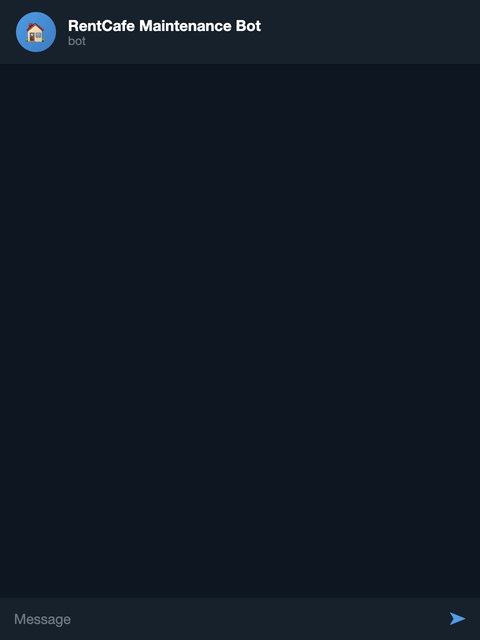

# Rent Agent

Automated maintenance and pest control request agent for RentCafe resident portals.

Message a Telegram bot to submit maintenance requests, or have pest control scheduled automatically every week. Gmail API auto-reads OTP codes for fully hands-free login.



## Why

I moved into an apartment. There were a lot of issues. At some point I stopped waiting for people to fix them.

Technically I'm not fixing anything myself — I'm just putting in work orders. But even that was a chore: log into the resident portal, get past the captcha, wait for the email OTP, fill out the same form with the same dropdowns, again and again. Rule of thumb: if I have to do something manually three times, find an automation for it.

And since our building requires pest control to be re-requested every single week (and I kept forgetting), that's on a cron job now. Autopay, but for pest control.

## How It Works

1. **Browserbase** cloud browser handles Cloudflare challenges and persists cookies across sessions
2. **Playwright** automates the RentCafe portal (login, form submission)
3. **Telegram Bot** lets you message requests like "leaky faucet in bathroom"
4. **Gmail API** auto-reads OTP verification codes from your inbox (no manual entry needed)
5. **Cron scheduler** auto-submits pest control requests weekly

## Setup

### Prerequisites

- Node.js 18+
- [Browserbase](https://browserbase.com) account (API key + project ID)
- Telegram Bot (create via [@BotFather](https://t.me/BotFather))
- Google Cloud project with Gmail API enabled (for auto-OTP)

### Install

```bash
npm install
```

### Configure

```bash
cp .env.example .env
# Edit .env with your details
```

Required:
- `RENTCAFE_EMAIL` — your RentCafe login email
- `BROWSERBASE_API_KEY` — from [Browserbase dashboard](https://browserbase.com)
- `BROWSERBASE_PROJECT_ID` — your Browserbase project ID
- `TELEGRAM_BOT_TOKEN` — from [@BotFather](https://t.me/BotFather)

For auto-OTP (recommended):
- `GMAIL_CLIENT_ID`, `GMAIL_CLIENT_SECRET` — from [Google Cloud Console](https://console.cloud.google.com/apis/credentials)
- `GMAIL_REFRESH_TOKEN` — generated via `npm run gmail-setup`

### Gmail API Setup (One-Time)

```bash
# 1. Create OAuth2 credentials at https://console.cloud.google.com/apis/credentials
# 2. Enable Gmail API at https://console.cloud.google.com/apis/library/gmail.googleapis.com
# 3. Add GMAIL_CLIENT_ID and GMAIL_CLIENT_SECRET to .env
# 4. Run:
npm run gmail-setup
# 5. Follow the prompts, then add GMAIL_REFRESH_TOKEN to .env
```

### First-Time Login

```bash
npm run login
```

This creates a Browserbase session that:
1. Automatically solves Cloudflare captchas
2. Navigates to RentCafe and fills your email
3. Prompts you for the OTP code from your email
4. Saves cookies via Browserbase persistent context

### Run the Agent

```bash
npm run dev
```

Starts:
- Telegram bot (or Express server for SMS fallback)
- Cron scheduler for weekly pest control

### CLI Submission

```bash
npm run submit -- "leaky faucet in kitchen"
npm run submit -- "pest control"
```

## Telegram Commands

| Message | Action |
|---------|--------|
| `leaky faucet in bathroom` | Creates a plumbing maintenance request |
| `pest control` | Submits a pest control request |
| `/login` | Triggers re-authentication |
| `/status` | Checks if agent is logged in |
| `/help` | Shows available commands |
| `123456` (digits) | Supplies OTP code during login |

## Architecture

```text
You (Telegram) → Telegram Bot API → Agent Server
                                        ↓
                                   Playwright → Browserbase (cloud) → RentCafe
                                        ↑                ↑
                                   Cron Scheduler    Gmail API (auto-OTP)
```

### Why Browserbase?

RentCafe uses Cloudflare Turnstile which blocks automated browsers. Browserbase provides:
- **Captcha solving** — automatically handles Cloudflare challenges
- **Persistent contexts** — cookies survive across sessions (no re-login needed)
- **Stealth browsing** — residential fingerprints that bypass bot detection

### Why Gmail API?

RentCafe uses email-based OTP for login. The Gmail API:
- **Auto-reads OTP codes** — polls inbox for verification emails, extracts the code
- **Fully hands-free** — no need to manually forward or type codes
- **Falls back gracefully** — if Gmail isn't configured, asks you via Telegram

## Deployment

### Docker

```bash
docker build -t rent-agent .
docker run --env-file .env rent-agent
```

### Railway / Render

1. Push to GitHub
2. Connect repo to Railway or Render
3. Set environment variables
4. Deploy — the agent runs continuously

## Configuration

| Env Variable | Description | Default |
|---|---|---|
| `RENTCAFE_URL` | Your property's RentCafe login URL | — |
| `RENTCAFE_EMAIL` | Your login email | — |
| `BROWSERBASE_API_KEY` | Browserbase API key | — |
| `BROWSERBASE_PROJECT_ID` | Browserbase project ID | — |
| `BROWSERBASE_CONTEXT_ID` | Context ID for cookie persistence | — |
| `TELEGRAM_BOT_TOKEN` | Telegram bot token from BotFather | — |
| `TELEGRAM_CHAT_ID` | Your Telegram chat ID (auto-detected on first message) | — |
| `GMAIL_CLIENT_ID` | Google OAuth2 client ID | — |
| `GMAIL_CLIENT_SECRET` | Google OAuth2 client secret | — |
| `GMAIL_REFRESH_TOKEN` | Google OAuth2 refresh token | — |
| `GMAIL_OTP_SENDER` | Email sender to match for OTP emails | `noreply` |
| `TWILIO_ACCOUNT_SID` | Twilio account SID (SMS fallback) | — |
| `TWILIO_AUTH_TOKEN` | Twilio auth token | — |
| `TWILIO_PHONE_NUMBER` | Twilio phone number | — |
| `USER_PHONE_NUMBER` | Your phone number | — |
| `PORT` | Webhook server port | `3000` |
| `PEST_CONTROL_CRON` | Cron schedule for pest control | `0 9 * * 1` (Mon 9am) |
